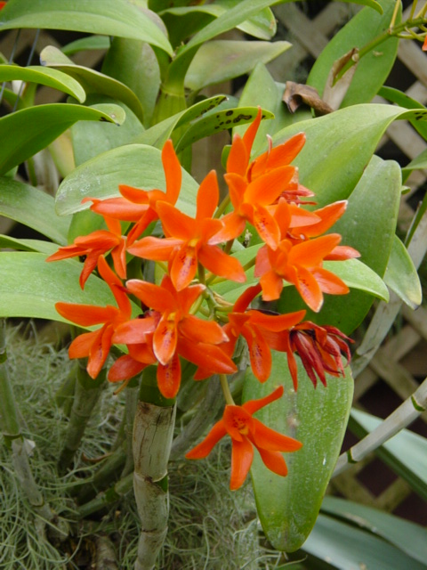
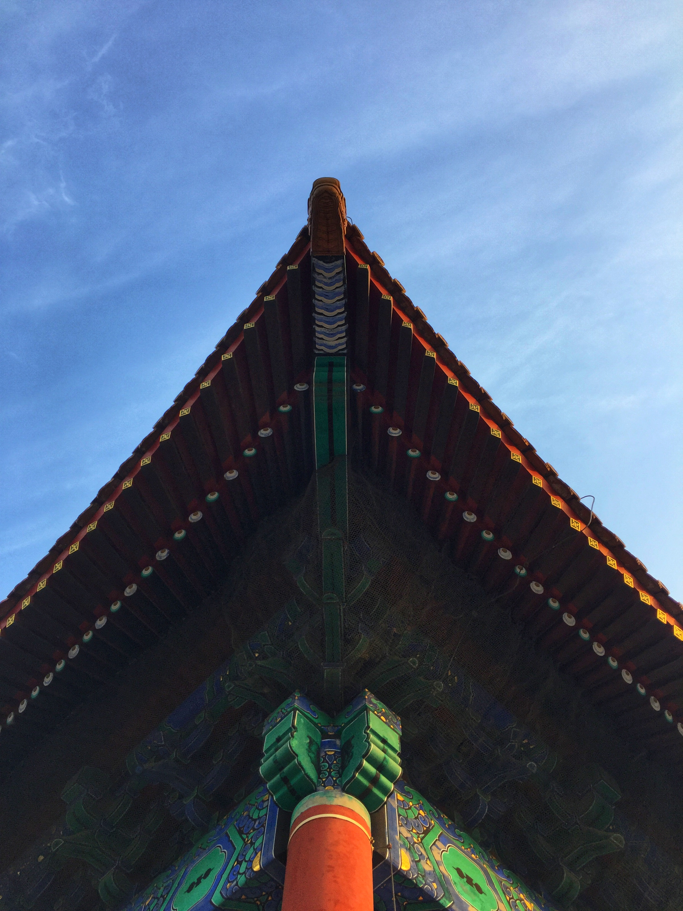
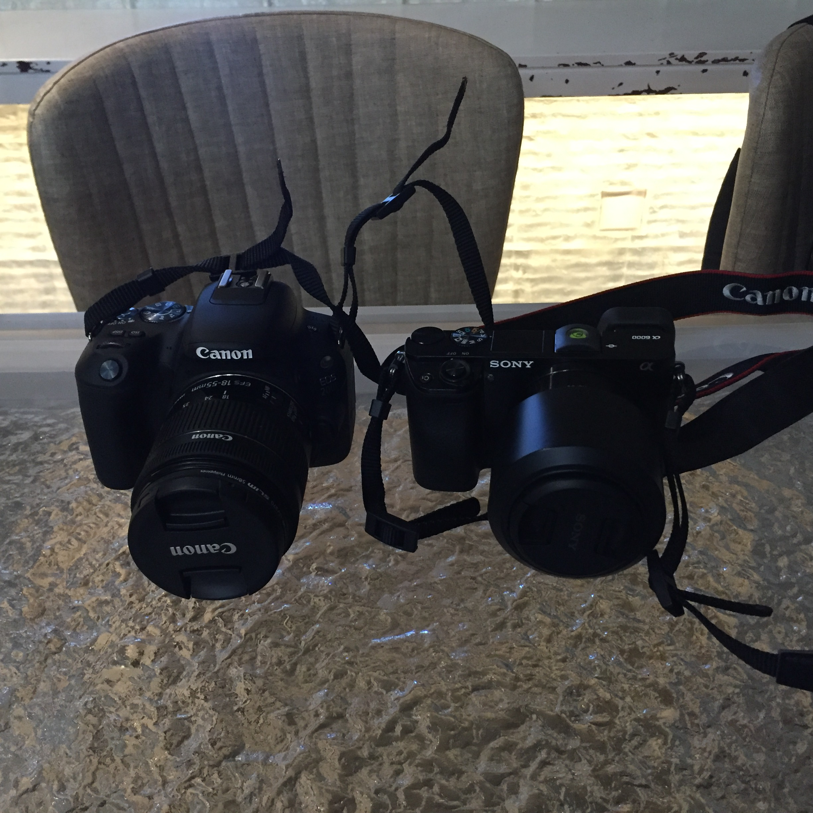

# 1.2.2019 
不怎么晴 北航 海淀 北京  

## Species Today
Orange cattleya 橙花哥丽兰 Guarianthe aurantiaca  兰科 树兰亚科   

## Photo Today
  
device: iphone6  
settings: 4mm F/2.2 1/388s iso:32  
process: Snapseed
H  
place: 故宫博物院 神武门楼一角   
被同学叫去一起拍故宫博物院，回来懒得整理和修图了，先弄一张手机的  

## Write Something  
今天去故宫博物院玩了一个白天。

不能算是正常的旅游，因为是以拍照为主。同学甚至以馆内也没什么好拍的为由拒绝了购买珍宝馆和钟表馆的门票。

对 50mm F1.8的镜头有了更深刻的认识吧，认识就是果然焦距太长了，果然还是35mm F1.8的好，中等距离，室内也能拍得比较好。往前走两步往往能走，退两步有时候没法退导致没法构图了。但是说好了近期不再买镜头了，去美国看有没有便宜的二手货捡。

都说定焦的难，我觉得没什么难的，定焦定死了，无非就是多走几步罢了。16-50的头我反倒老得想想用什么焦段拍。

  
再说说试了同学的单反，自己对单反和微单的感受：  
单反耗电少，18-55的套机头也有很长的手动部分，扭动的阻尼感很好，很有拍照的感觉。  
微单，16-50的饼干头真是，一言难尽，电动的毫无操作的乐趣，小巧和轻便我现在也基本不需要，耗电快，我一定得买个副厂的座充和电池了。  
不过微单真正的所见即所得还是挺适合我的，也许我就该买个“专业”一点的，sony的A7？不过算了，近几年也不可能新买一个了。  
关于故宫博物馆的，“游记”？我留着明天写算了。
