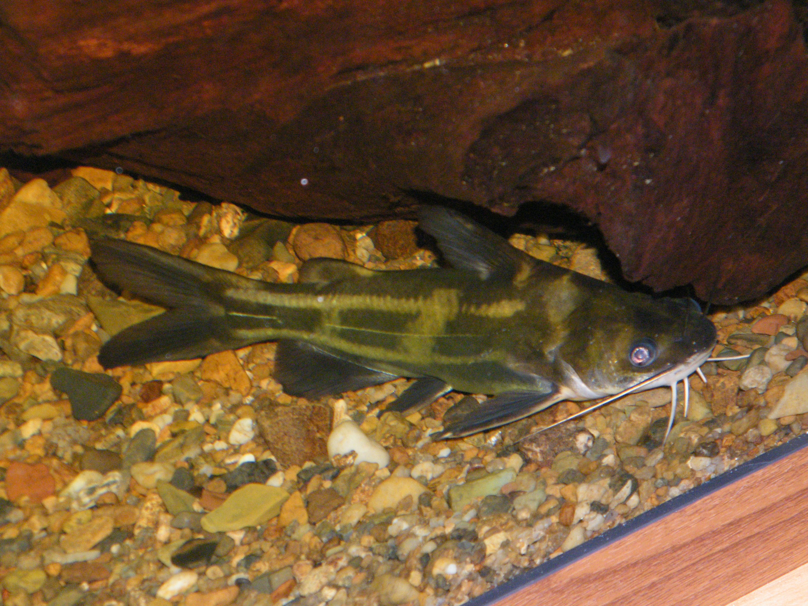
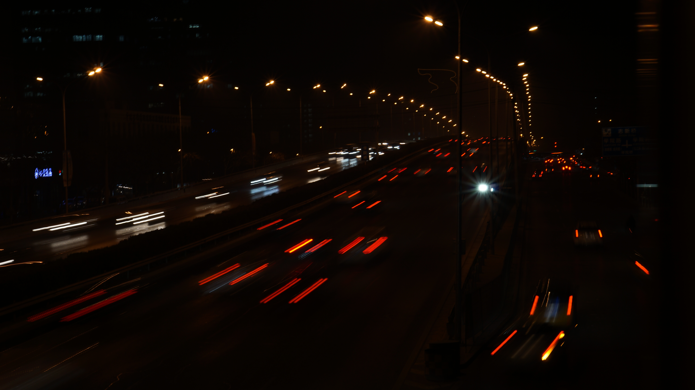
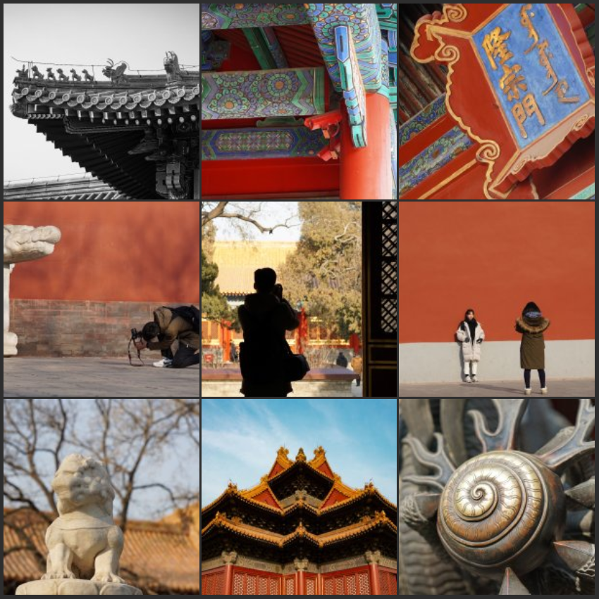

# 1.3.2019 Thu
霾 北航 海淀 北京  

## Species Today
Yellowhead catfish 黄颡鱼 Pelteobagrus fulvidraco     

## Photo Today
  
device: A6000  
settings: 50mm F/14 1/2s iso:100   
process: None  
place: 北航北门天桥     
终于是带着三脚架拍了一个长曝光（其实也不长）的车流。忘了东南门外还有个小天桥，绕了一圈去北门，不过这个上桥的角度倒也很特别。  

## Write Something  
去故宫一半是因为同学约拍照，一半是因为单院长的讲座吧。他提到的地方我基本都去了，也算是对得起他的宣传了！

昨天故宫随便找了九图  
  
我大概还是被50mm的焦段限制了，对细小的物更兴趣，我也好像拍了几张建筑结构，也很有意思。

我觉得我根本不能算是游客，写不出故宫游记，暂时鸽了。