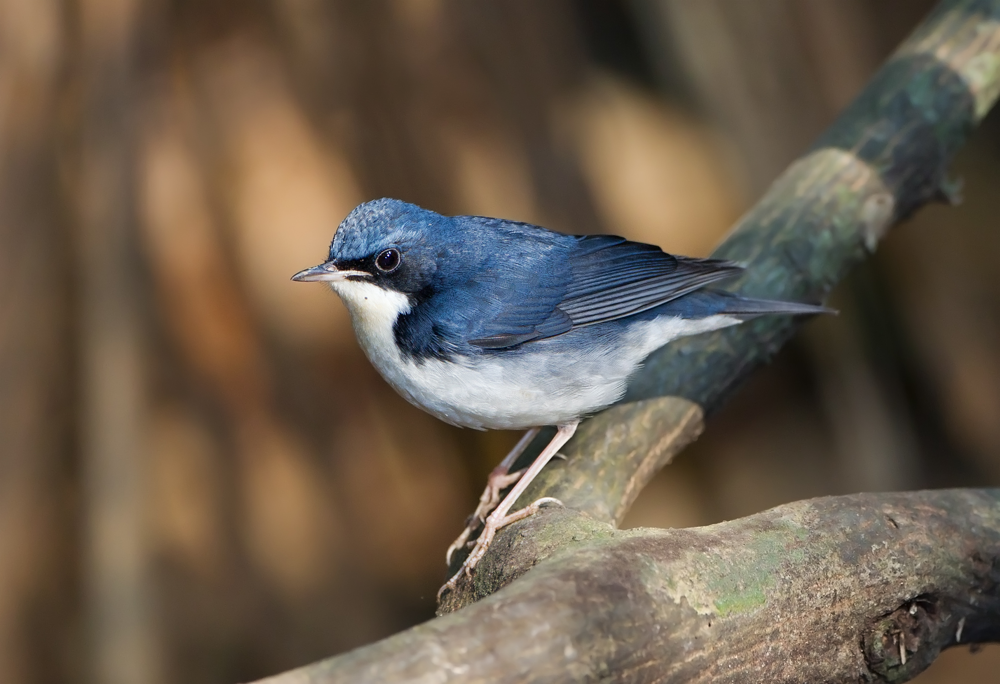

# 1.6.2019 Sun
霾 北航 海淀 北京  

## Species Today
Siberian blue robin 蓝歌鸲 Larvivora cyane     

## Photo Today
  
device: A6000  
settings: 50mm F/1.8 1/50s iso:400   
process: None  
place: 北航寝室     
李锦记颁奖居然送了他们的产品，不过我没有正装，懒得去了。早知道就要番茄酱了，还能吃面包用。送给北京室友回家用算了。黄豆酱留着尝尝。  

## Write Something  
课设合代码效率倒挺高，毕竟python，我也不太需要写得多么规范。而且盯着他们把输入输出搞清楚按要求来就完事了。我的逻辑还是很清楚的。

但是没想到跟踪效果这么不好，说实话，meanshift用于红外视频就不是很好吧。

现在他还不想改代码，埋怨我们前面分割的形状不好。明天再说吧，如果没办法解决那就只能大家都摆烂了。

其实我一个人就能做完，但是既然都分了组，就懒得做别人的内容了。罢了，随便摆烂搞完做毕设去了。